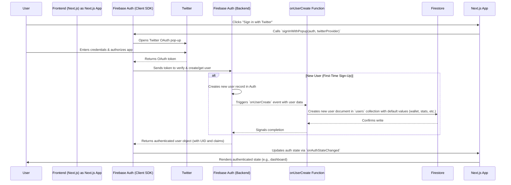

# Playcer Authentication Flow: Technical Report

**To:** Technical Stakeholders  
**From:** The Development Team  
**Re:** Detailed Breakdown of the User Sign-Up and Sign-In Process

---

## 1. Overview

This document provides a detailed technical explanation of the authentication flow for the Playcer application. The system is designed to be secure, streamlined, and user-friendly, leveraging Firebase Authentication with Twitter as the sole identity provider. This approach simplifies the user experience by eliminating the need for traditional email/password management while providing a robust and secure authentication mechanism.

The flow involves a coordinated effort between the Next.js frontend, the Firebase Client SDK, and a backend Cloud Function trigger.

---

## 2. Architecture Diagram

The following diagram illustrates the sequence of events for both the initial user sign-up and subsequent sign-ins.

---

## 3. Step-by-Step Flow Description

1.  **User Initiation**: The process begins when a user clicks the "Sign in with Twitter" button on either the `/signin` or `/signup` pages. This action is handled by the `SignInForm` or `SignUpForm` components.

2.  **Firebase Popup**: The frontend calls the `signIn` function from our custom `useAuth` hook (`src/hooks/use-auth.tsx`). This function, in turn, calls Firebase's `signInWithPopup` method, which presents the user with a secure pop-up window hosted by Twitter.

3.  **Twitter Authentication**: The user securely enters their Twitter credentials and authorizes the Playcer application. This interaction happens directly between the user and Twitter; Playcer never sees the user's password.

4.  **Token Exchange**: Upon successful authorization, Twitter returns an OAuth token to the Firebase Client SDK.

5.  **Firebase Backend Verification**: The Firebase SDK sends this token to the Firebase Authentication backend for verification. The backend validates the token with Twitter and then performs one of two actions:
    *   **Existing User**: If a user with that Twitter account already exists in Firebase Auth, the backend retrieves the user's profile.
    *   **New User**: If this is the first time the user has signed in, the backend creates a new user record in the Firebase Authentication service.

6.  **`onUserCreate` Trigger (New Users Only)**: The creation of a new user in the Firebase Auth service automatically triggers the `onusercreate` Cloud Function (`functions/src/index.ts`). This is a critical step for provisioning a new user in our system. The function:
    *   Receives the new user's authentication data (UID, Display Name, Photo URL).
    *   Creates a corresponding document for the user in the `/users/{uid}` collection in Firestore.
    *   Populates this new document with default values, such as a starting `walletBalance` of $100.00, `wins` and `losses` set to 0, and a `kycStatus` of "pending".

7.  **Client-Side State Update**: The Firebase backend returns the authenticated user object (including their unique UID and any custom claims) to the client-side SDK. The `onAuthStateChanged` listener in the `useAuth` hook detects this change.

8.  **App Renders Authenticated State**: The `useAuth` hook updates its state, making the `user` object available throughout the application. Components like the `SiteHeader` update to show the user's profile and the application automatically navigates the user to their dashboard, providing a seamless transition from login to a fully authenticated experience.

---

## 4. Key Components

*   **`src/hooks/use-auth.tsx`**: The central client-side hook for managing auth state. It wraps Firebase's `onAuthStateChanged` and provides a simple `signIn` and `signOut` API to the rest of the application.
*   **`src/lib/firebase.ts`**: Initializes the Firebase client app and exports the `auth` and `twitterProvider` instances.
*   **`functions/src/index.ts`**: Contains the `onusercreate` backend function that is essential for initializing user data in Firestore upon first sign-up.

This architecture provides a secure, scalable, and user-friendly authentication system that is tightly integrated with our backend data model.
